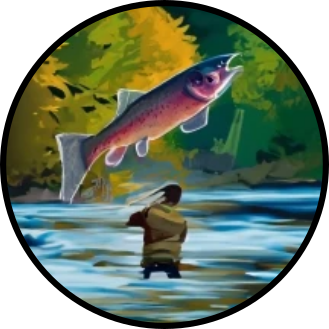

# Streamfish 

Low-latency adaptive sampling using asynchroneous streams and RPC.

## Table of contents

1. [Motivation]()
2. [Features]()
3. [Documentation]()
4. [Warnings]()
5. [Requirements]()
6. [Resources]()
7. [Quick start]()
8. [Dependencies]()

## Motivation

I wanted to better understand how the adaptive sampling mechanics work. Streamfish started as a side project to re-implement the [ReadUntil API](https://github.com/nanoporetech/read_until_api) and parts of the [Minknow API](https://github.com/nanoporetech/minknow_api/tree/master/proto/minknow_api) in Rust.

While Streamfish approaches the adaptive sampling mechanics from a slightly different angle than [Readfish](https://github.com/LooseLab/Readfish), it implements many of the principles explored by the [LooseLab](https://github.com/LooseLab). You could consider Streamfish a highly experimental derivative of Readfish.

It is very much recommended **not** to use it for real sequencing runs, unless you are swimming in money or something.

## Features

* Low-latency asynchroneous streaming implementation of the adaptive sampling client
* RPC server for distributed adaptive sampling decisions and dynamic feedback loops
* `Guppy` and `Dorado` implementations, configurablefor for multiple GPUs
* Adaptive sampling experiment for depletion, targeted sequencing, coverage balancing and unknown sequences
* Experiment testing and latency optimization runners using [`Icarust`](https://github.com/LooseLab/Icarust)
* "Slice-an-dice" partitioning of flow cells for high throughput latency optimization using multiple clients
* Dynamic adaptive sampling feedback loops for experimental condition switches and "slow" real-time analysis

## Documentation

A full description of the features and configurations can be found [in the documentation]().

## Warnings

This is an experimental version. **It is not user-friendly**.

**Do not use `Streamfish` for real experiments - please use [`Readfish`](https://github.com/LooseLab/readfish) or other suitable implementations!**

## Requirements

* Linux system with suitable resources and GPU (see below)
* `Docker` and `docker compose` for running the client, servers and simulations
* `MinKNOW > v.5.3` for adaptive sampling playback or sequence runs (maybe don't do those for now)

## Resources

I have mainly tested this system on a gaming computer running Ubuntu 20.04 LTS with 16 threads (AMD), NVIDIA GTX 3060 12GB RAM with drivers supporting CUDA 11.4 or higher (configured in container) and 48 GB RAM. Streamfish client and server run their asynchroneous routines on a single thread. However, basecalling and reference mapping require some more resources depending on the throughput and experiment configuration you want to run.

## Quick start

...

## Dependencies
